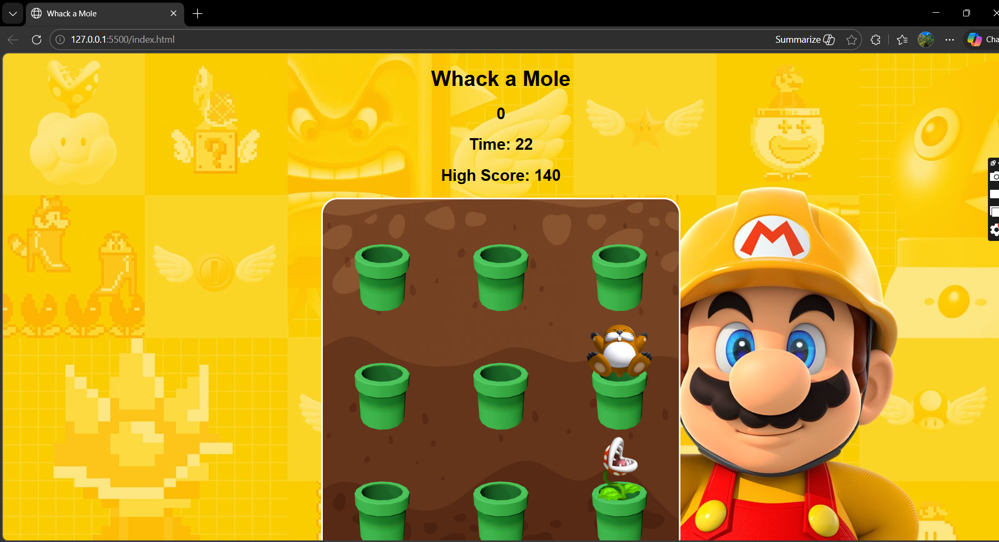

#  Whack-a-Mole Game

A simple browser-based Whack-a-Mole game built using HTML, CSS, and JavaScript. Hit the mole, avoid the plant, and try to beat your highest score before time runs out.

##  How to Play

- Click on the **mole** to gain points (+10 per hit)
- Avoid clicking the **piranha plant** or the game ends instantly
- You have **30 seconds** to score as much as possible
- Try to beat your **highest score**, which is saved in your browser

##  Game Rules

-  Mole = +10 points  
-  Plant = Game Over  
-  Timer = 30 seconds  
-  High score is stored locally (even after refresh)

##  Features

- Random mole and plant spawning
- Countdown timer
- Game over system (time out or wrong click)
- Persistent high score using local storage
- Restart button to play again instantly

##  Built With

- HTML  
- CSS  
- JavaScript 

## How to Run

1. Download or clone the project  
2. Open `index.html` in any browser  
3. Start playing 🎮  

I just wanted to let you know that there's no need for installation

## Preview 

